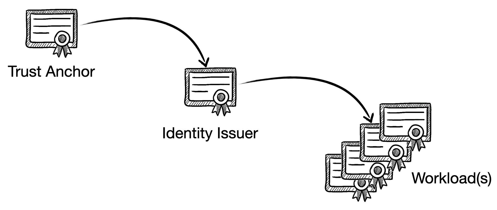

# Certificates

Linkerd automatically enable mTLS for all TCP traffic between meshed pods. To do so, it relies on several certificates that should be in place for the control plane to work as expected. You can either provide them during the installation or using thirds party tools like Cert-Manager and Trust-Manager. 



## References
- https://linkerd.io/2-edge/tasks/generate-certificates/
- https://kubernetes.io/docs/reference/kubernetes-api/authentication-resources/token-review-v1/
- https://github.com/linkerd/linkerd2-proxy/blob/main/linkerd/proxy/identity-client/src/certify.rs
- https://github.com/linkerd/linkerd2-proxy/blob/main/linkerd/proxy/spire-client/src/lib.rs
- https://github.com/linkerd/linkerd2-proxy/blob/main/linkerd/app/src/identity.rs
- https://github.com/linkerd/linkerd2/blob/main/controller/identity/validator.go
- https://github.com/linkerd/linkerd2/blob/main/proxy-identity/main.go

# Prerequisites

- macOS/Linux/Windows with a Unix‑style shell
- k3d (v5+) for local Kubernetes clusters
- kubectl (v1.25+)

# Tutorial

## 1. Create a Local Kubernetes Cluster

Use k3d and the `cluster.yaml` to spin up a lightweight Kubernetes cluster:

```
k3d cluster create --kubeconfig-update-default \
  -c ./cluster.yaml
```

## 2. Generate Identity Certificates

Linkerd requires a trust anchor (root CA) and an issuer (intermediate CA) for mTLS identity.

```
step certificate create root.linkerd.cluster.local ./certificates/ca.crt ./certificates/ca.key \
    --profile root-ca \
    --no-password \
    --insecure
step certificate create identity.linkerd.cluster.local ./certificates/issuer.crt ./certificates/issuer.key \
    --profile intermediate-ca \
    --not-after 8760h \
    --no-password \
    --insecure \
    --ca ./certificates/ca.crt \
    --ca-key ./certificates/ca.key
```

## 3. Install Linkerd via Helm

```
helm repo add linkerd-edge https://helm.linkerd.io/edge
helm repo update
helm install linkerd-crds linkerd-edge/linkerd-crds \
  -n linkerd --create-namespace --set installGatewayAPI=true
helm upgrade --install linkerd-control-plane \
  -n linkerd \
  --set-file identityTrustAnchorsPEM=./certificates/ca.crt \
  --set-file identity.issuer.tls.crtPEM=./certificates/issuer.crt \
  --set-file identity.issuer.tls.keyPEM=./certificates/issuer.key \
  --set controllerLogLevel=debug \
  --set policyController.logLevel=debug \
  --set policyController.logLevel=debug \
  linkerd-edge/linkerd-control-plane
```

## 3. The Root Trust Anchor Certificate

Linkerd’s Root Trust Anchor is a public CA certificate that establishes the ultimate point of trust for all service-mesh certificates. It never issues workload certificates directly. Instead, it signs intermediate CA certificates, which in turn issue certificates for workloads. This division ensures that clusters (or multiple clusters) can each run their own issuer yet validate against the same root anchor, maintaining mesh-wide trust without exposing the root key in day-to-day workflows.

The Root Trust Anchor certificate (containing only the public key) is stored in the ConfigMap named `linkerd-identity-trust-roots`. Since this ConfigMap holds no private key material, it’s safe to store it in plain view and use it to bootstrap trust for all intermediates and end-entity certificates. It's common that enterprises will use their own PKI that will then use to generate a new intermediate.

When a new Linkerd proxy is injected into a workload pod, it receives the trust configuration through environment variables and mounted volumes.

```
linkerd-proxy:
    Container ID:    containerd://f348b4bebec14d557c44951f309e07fac969de2ea93f20e9d1920b4a8e02180e
    Image:           cr.l5d.io/linkerd/proxy:edge-25.5.3
    ...
    Environment:
     ...
      LINKERD2_PROXY_IDENTITY_DIR:                               /var/run/linkerd/identity/end-entity
      LINKERD2_PROXY_IDENTITY_TRUST_ANCHORS:                     <set to the key 'ca-bundle.crt' of config map 'linkerd-identity-trust-roots'>  Optional: false
      LINKERD2_PROXY_IDENTITY_TOKEN_FILE:                        /var/run/secrets/tokens/linkerd-identity-token
      ...
    Mounts:
      /var/run/linkerd/identity/end-entity from linkerd-identity-end-entity (rw)
      /var/run/secrets/tokens from linkerd-identity-token (rw)
...
Volumes:
  trust-roots:
    Type:      ConfigMap (a volume populated by a ConfigMap)
    Name:      linkerd-identity-trust-roots
    Optional:  false
  linkerd-identity-token:
    Type:                    Projected (a volume that contains injected data from multiple sources)
    TokenExpirationSeconds:  86400
  linkerd-identity-end-entity:
    Type:        EmptyDir (a temporary directory that shares a pod's lifetime)
    Medium:      Memory
    SizeLimit:   <unset>
```

When the Linkerd proxy starts, it loads the trust anchors the certificate defined by `LINKERD2_PROXY_IDENTITY_TRUST_ANCHORS`. Then it will ensure that the directory at `LINKERD2_PROXY_IDENTITY_DIR` exists and generate both public and ECDSA P-256 private key, encodes it to PKCS#8 PEM, and writes it as `key.p8`. 
```
func generateAndStoreKey(p string) (key *ecdsa.PrivateKey, err error) {
    key, err = tls.GenerateKey()
    if err != nil {
        return
    }
    pemb := tls.EncodePrivateKeyP8(key)
    err = os.WriteFile(p, pemb, 0600)
    return
}
```
Then it generates X.509 CSR with the Common Name and DNS SAN, and writes it as `csr.der`.
```
func generateAndStoreCSR(p, id string, key *ecdsa.PrivateKey) ([]byte, error) {
    csr := x509.CertificateRequest{
        Subject:  pkix.Name{CommonName: id},
        DNSNames: []string{id},
    }
    csrb, err := x509.CreateCertificateRequest(rand.Reader, &csr, key)
    if err != nil {
        return nil, fmt.Errorf("failed to create CSR: %w", err)
    }
    if err := os.WriteFile(p, csrb, 0600); err != nil {
        return nil, fmt.Errorf("failed to write CSR: %w", err)
    }
    return csrb, nil
}
```
Then the Rust binary starts and read the service-account JWT via `TokenSource::load()`, loads both Trust Anchors and the two files previously generated (key.p8, csr.der) and attaches the raw CSR bytes to a gRPC request:
```
let req = tonic::Request::new(api::CertifyRequest {
  token: token.load()?,                   
  identity: name.to_string(),               
  certificate_signing_request: docs.csr_der.clone(),
});
let api::CertifyResponse { leaf_certificate, intermediate_certificates, valid_until } =
  IdentityClient::new(client).certify(req).await?.into_inner();
```
Here, identity carries the SPIFFE ID (spiffe://<trust-domain>/ns/<ns>/sa/<sa>) and the control-plane uses that to issue you a cert whose URI SAN is set to your SPIFFE ID—the CSR’s own SANs are ignored for URI purposes.

## 4. The Identity Intermediate Issuer Certificate

The intermediate issuer certificate is stored in the `linkerd-identity-issuer` secret in the `linkerd` namespace. When the Identity service receives a CSR, it first validates the token by creating a `TokenReview` against the `authentication.k8s.io/v1/tokenreviews` endpoint of the Kubernetes API with:
- The ServiceAccount token from the CSR 
- The `identity.l5d.io` audience. (The audience restriction ensures only tokens issued for Linkerd are accepted.)

If the validation fails or the token is not authentcated the validation fails immediately, otherwise, the API server will go ahead and verify the token’s signature, expiration, issuer, and intended audience.

The Identity service then parses the ServiceAccount reference (system:serviceaccount:<namespace>:<name>), verify that each segment is a valid DNS-1123 label and constructs the SPIFFE URI under the configured trust domain.

Next, it builds an x509.Certificate template with:
- The public key from the CSR
- The SAN set to the SPIFFE URI
- A validity period from now until 24 hours later (default)

It signs the certificate using `x509.CreateCertificate(rand.Reader, &template, issuerCert, csr.PublicKey, issuerKey)` and sent back to the proxy.

To see this workflowby changing the verbosity of the `indentity` pod to `debug`:
```
kubectl logs -n linkerd       linkerd-identity-56d78cdd86-8c64w 
Defaulted container "identity" out of: identity, linkerd-proxy, linkerd-init (init)
time="2025-05-21T12:11:32Z" level=info msg="running version enterprise-2.17.1"
time="2025-05-21T12:11:32Z" level=info msg="starting gRPC license client" component=license-client grpc-address="linkerd-enterprise:8082"
time="2025-05-21T12:11:32Z" level=info msg="starting admin server on :9990"
time="2025-05-21T12:11:32Z" level=info msg="Using k8s client with QPS=100.00 Burst=200"
time="2025-05-21T12:11:32Z" level=info msg="POST https://10.247.0.1:443/apis/authorization.k8s.io/v1/selfsubjectaccessreviews 201 Created in 1 milliseconds"
time="2025-05-21T12:11:32Z" level=debug msg="Loaded issuer cert: -----BEGIN CERTIFICATE-----\nMIIBsjCCAVigAwIBAgIQZelMfABi9RPUkaa1fEXfIjAKBggqhkjOPQQDAjAlMSMw\nIQYDVQQDExpyb290LmxpbmtlcmQuY2x1c3Rlci5sb2NhbDAeFw0yNTA1MjExMjEx\nMDJaFw0yNjA1MjExMjExMDJaMCkxJzAlBgNVBAMTHmlkZW50aXR5LmxpbmtlcmQu\nY2x1c3Rlci5sb2NhbDBZMBMGByqGSM49AgEGCCqGSM49AwEHA0IABO52MoQ7mva8\nYPg7abR7rqO3UhE0csDoPgFKoqM54JAfQY9/8rwgKWn3AUvH9NKNNy46Nq0MmPFd\nZgz/qSX3i0WjZjBkMA4GA1UdDwEB/wQEAwIBBjASBgNVHRMBAf8ECDAGAQH/AgEA\nMB0GA1UdDgQWBBTSq+l58FRN+T4ZSwqPyX9EFJmysTAfBgNVHSMEGDAWgBQpPJRY\nnNGBgGrC7LAnIDcwXkIHVjAKBggqhkjOPQQDAgNIADBFAiA7bw59dCwkhQ9CSyUN\nLR4/U7nt2mFV519zCtvD5cJmjgIhAKhPME9EJVtN28L6ZpaYSWbnSTyih1aL/b7m\neqW0acqg\n-----END CERTIFICATE-----\n"
time="2025-05-21T12:11:32Z" level=debug msg="Issuer has been updated"
time="2025-05-21T12:11:32Z" level=info msg="starting gRPC server on :8080"
time="2025-05-21T12:11:37Z" level=debug msg="Validating token for linkerd-identity.linkerd.serviceaccount.identity.linkerd.cluster.local"
time="2025-05-21T12:11:37Z" level=info msg="POST https://10.247.0.1:443/apis/authentication.k8s.io/v1/tokenreviews 201 Created in 2 milliseconds"
time="2025-05-21T12:11:37Z" level=info msg="issued certificate for linkerd-identity.linkerd.serviceaccount.identity.linkerd.cluster.local until 2025-05-22 12:11:57 +0000 UTC: a7048ff55002e726894ad92eccfd6738fcbc72b496d58ef3071a73c866c8e311"
```

## 5. The Proxy Leaf Certificate

Once received, the proxy loads the certificate into its in-memory store and begins using it for mTLS. It automatically renews the certificate at approximately 70% of its TTL, requesting a new CSR to rotate the certificate seamlessly.

```
fn refresh_in(config: &Config, expiry: SystemTime) -> Duration {
    match expiry.duration_since(SystemTime::now()).ok().map(|d| d * 7 / 10) // 70% duration
    {
        None => config.min_refresh,
        Some(lifetime) if lifetime < config.min_refresh => config.min_refresh,
        Some(lifetime) if config.max_refresh < lifetime => config.max_refresh,
        Some(lifetime) => lifetime,
    }
}
```