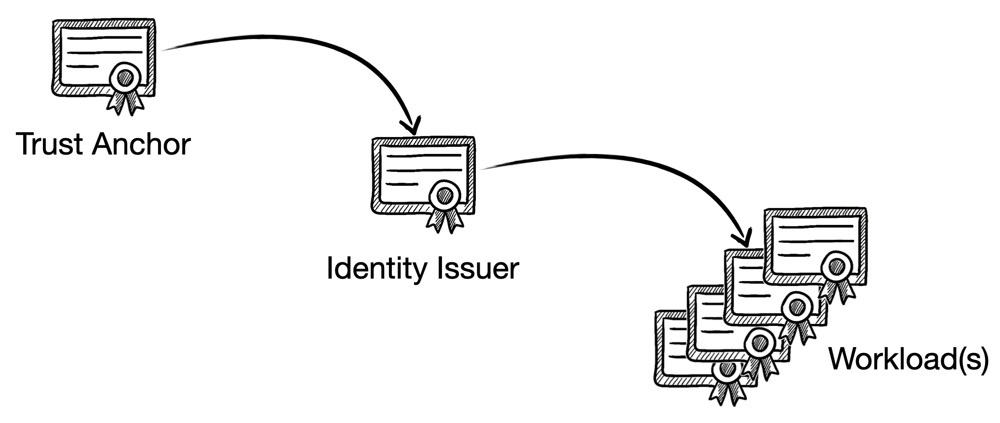

# 인증서

Linkerd는 메시된(pod 간 연결된) 모든 TCP 트래픽에 대해 자동으로 mTLS를 활성화합니다. 이를 위해 제어 플레인이 정상적으로 작동하려면 몇 가지 인증서가 필요합니다. 이 인증서는 설치 시 제공하거나 Cert-Manager 및 Trust-Manager와 같은 타사 도구를 사용하여 설정할 수 있습니다.



## 참고 자료
- https://linkerd.io/2-edge/tasks/generate-certificates/
- https://kubernetes.io/docs/reference/kubernetes-api/authentication-resources/token-review-v1/
- https://github.com/linkerd/linkerd2-proxy/blob/main/linkerd/proxy/identity-client/src/certify.rs
- https://github.com/linkerd/linkerd2-proxy/blob/main/linkerd/proxy/spire-client/src/lib.rs
- https://github.com/linkerd/linkerd2-proxy/blob/main/linkerd/app/src/identity.rs
- https://github.com/linkerd/linkerd2/blob/main/controller/identity/validator.go
- https://github.com/linkerd/linkerd2/blob/main/proxy-identity/main.go

# 사전 준비 사항

- Unix 스타일 셸을 지원하는 macOS/Linux/Windows
- 로컬 Kubernetes 클러스터를 위한 k3d (v5+)
- kubectl (v1.25+)

# 튜토리얼

## 1. 로컬 Kubernetes 클러스터 생성

k3d와 `cluster.yaml`을 사용하여 경량 Kubernetes 클러스터를 생성합니다:

```
k3d cluster create --kubeconfig-update-default \
  -c ./cluster.yaml
```

## 2. 신원 인증서 생성

Linkerd는 mTLS 신원을 위해 신뢰 앵커(루트 CA)와 발급자(중간 CA)가 필요합니다.

```
step certificate create root.linkerd.cluster.local ./certificates/ca.crt ./certificates/ca.key \
    --profile root-ca \
    --no-password \
    --insecure
step certificate create identity.linkerd.cluster.local ./certificates/issuer.crt ./certificates/issuer.key \
    --profile intermediate-ca \
    --not-after 8760h \
    --no-password \
    --insecure \
    --ca ./certificates/ca.crt \
    --ca-key ./certificates/ca.key
```

## 3. Helm을 통한 Linkerd 설치

```
helm repo add linkerd-edge https://helm.linkerd.io/edge
helm repo update
helm install linkerd-crds linkerd-edge/linkerd-crds \
  -n linkerd --create-namespace --set installGatewayAPI=true
helm upgrade --install linkerd-control-plane \
  -n linkerd \
  --set-file identityTrustAnchorsPEM=./certificates/ca.crt \
  --set-file identity.issuer.tls.crtPEM=./certificates/issuer.crt \
  --set-file identity.issuer.tls.keyPEM=./certificates/issuer.key \
  --set controllerLogLevel=debug \
  --set policyController.logLevel=debug \
  --set policyController.logLevel=debug \
  linkerd-edge/linkerd-control-plane
```

## 3. 루트 신뢰 앵커 인증서

Linkerd의 루트 신뢰 앵커는 모든 서비스 메시 인증서의 최종 신뢰 지점을 설정하는 공개 CA 인증서입니다. 이 인증서는 직접 워크로드 인증서를 발급하지 않고, 대신 중간 CA 인증서를 서명하여 각 클러스터가 자체 발급자를 실행하면서도 동일한 루트 앵커를 통해 유효성을 검사할 수 있도록 합니다.

루트 신뢰 앵커 인증서(공개 키만 포함)는 `linkerd-identity-trust-roots`라는 ConfigMap에 저장됩니다. 이 ConfigMap은 개인 키를 포함하지 않으므로 안전하게 저장할 수 있으며, 모든 중간 및 최종 엔터티 인증서의 신뢰를 부트스트랩하는 데 사용됩니다.

새로운 Linkerd 프록시가 워크로드 파드에 주입되면, 환경 변수와 마운트된 볼륨을 통해 신뢰 구성을 수신합니다.

```
linkerd-proxy:
    Container ID:    containerd://f348b4bebec14d557c44951f309e07fac969de2ea93f20e9d1920b4a8e02180e
    Image:           cr.l5d.io/linkerd/proxy:edge-25.5.3
    ...
    Environment:
     ...
      LINKERD2_PROXY_IDENTITY_DIR:                               /var/run/linkerd/identity/end-entity
      LINKERD2_PROXY_IDENTITY_TRUST_ANCHORS:                     <set to the key 'ca-bundle.crt' of config map 'linkerd-identity-trust-roots'>  Optional: false
      LINKERD2_PROXY_IDENTITY_TOKEN_FILE:                        /var/run/secrets/tokens/linkerd-identity-token
      ...
    Mounts:
      /var/run/linkerd/identity/end-entity from linkerd-identity-end-entity (rw)
      /var/run/secrets/tokens from linkerd-identity-token (rw)
...
Volumes:
  trust-roots:
    Type:      ConfigMap (a volume populated by a ConfigMap)
    Name:      linkerd-identity-trust-roots
    Optional:  false
  linkerd-identity-token:
    Type:                    Projected (a volume that contains injected data from multiple sources)
    TokenExpirationSeconds:  86400
  linkerd-identity-end-entity:
    Type:        EmptyDir (a temporary directory that shares a pod's lifetime)
    Medium:      Memory
    SizeLimit:   <unset>
```

프록시가 시작되면, `LINKERD2_PROXY_IDENTITY_TRUST_ANCHORS`에 정의된 신뢰 앵커 인증서를 로드합니다. 그런 다음, `LINKERD2_PROXY_IDENTITY_DIR` 디렉터리를 확인하고, ECDSA P-256 개인 키를 생성하여 PKCS#8 PEM 형식으로 인코딩하고 `key.p8`로 저장합니다.

```
func generateAndStoreKey(p string) (key *ecdsa.PrivateKey, err error) {
    key, err = tls.GenerateKey()
    if err != nil {
        return
    }
    pemb := tls.EncodePrivateKeyP8(key)
    err = os.WriteFile(p, pemb, 0600)
    return
}
```

그런 다음, Common Name과 DNS SAN이 포함된 X.509 CSR을 생성하여 `csr.der`로 저장합니다.

```
func generateAndStoreCSR(p, id string, key *ecdsa.PrivateKey) ([]byte, error) {
    csr := x509.CertificateRequest{
        Subject:  pkix.Name{CommonName: id},
        DNSNames: []string{id},
    }
    csrb, err := x509.CreateCertificateRequest(rand.Reader, &csr, key)
    if err != nil {
        return nil, fmt.Errorf("failed to create CSR: %w", err)
    }
    if err := os.WriteFile(p, csrb, 0600); err != nil {
        return nil, fmt.Errorf("failed to write CSR: %w", err)
    }
    return csrb, nil
}
```

그런 다음, Rust 바이너리가 시작되어 `TokenSource::load()`를 통해 서비스 계정 JWT를 읽고, 이전에 생성된 신뢰 앵커 및 두 파일(`key.p8`, `csr.der`)을 로드하여 원시 CSR 바이트를 gRPC 요청에 첨부합니다:

```
let req = tonic::Request::new(api::CertifyRequest {
  token: token.load()?,                   
  identity: name.to_string(),               
  certificate_signing_request: docs.csr_der.clone(),
});
let api::CertifyResponse { leaf_certificate, intermediate_certificates, valid_until } =
  IdentityClient::new(client).certify(req).await?.into_inner();
```

여기서, identity는 SPIFFE ID(spiffe://<trust-domain>/ns/<ns>/sa/<sa>)를 포함하며, 제어 플레인은 이를 사용하여 URI SAN이 SPIFFE ID로 설정된 인증서를 발급합니다. CSR의 자체 SAN은 URI 목적을 위해 무시됩니다.


## 4. 프록시 리프 인증서

The intermediate issuer certificate is stored in the `linkerd-identity-issuer` secret in the `linkerd` namespace. When the Identity service receives a CSR, it first validates the token by creating a `TokenReview` against the `authentication.k8s.io/v1/tokenreviews` endpoint of the Kubernetes API with:
- The ServiceAccount token from the CSR 
- The `identity.l5d.io` audience. (The audience restriction ensures only tokens issued for Linkerd are accepted.)

If the validation fails or the token is not authentcated the validation fails immediately, otherwise, the API server will go ahead and verify the token’s signature, expiration, issuer, and intended audience.

The Identity service then parses the ServiceAccount reference (system:serviceaccount:<namespace>:<name>), verify that each segment is a valid DNS-1123 label and constructs the SPIFFE URI under the configured trust domain.

Next, it builds an x509.Certificate template with:
- The public key from the CSR
- The SAN set to the SPIFFE URI
- A validity period from now until 24 hours later (default)

It signs the certificate using `x509.CreateCertificate(rand.Reader, &template, issuerCert, csr.PublicKey, issuerKey)` and sent back to the proxy.

To see this workflowby changing the verbosity of the `indentity` pod to `debug`:
```
kubectl logs -n linkerd       linkerd-identity-56d78cdd86-8c64w 
Defaulted container "identity" out of: identity, linkerd-proxy, linkerd-init (init)
time="2025-05-21T12:11:32Z" level=info msg="running version enterprise-2.17.1"
time="2025-05-21T12:11:32Z" level=info msg="starting gRPC license client" component=license-client grpc-address="linkerd-enterprise:8082"
time="2025-05-21T12:11:32Z" level=info msg="starting admin server on :9990"
time="2025-05-21T12:11:32Z" level=info msg="Using k8s client with QPS=100.00 Burst=200"
time="2025-05-21T12:11:32Z" level=info msg="POST https://10.247.0.1:443/apis/authorization.k8s.io/v1/selfsubjectaccessreviews 201 Created in 1 milliseconds"
time="2025-05-21T12:11:32Z" level=debug msg="Loaded issuer cert: -----BEGIN CERTIFICATE-----\nMIIBsjCCAVigAwIBAgIQZelMfABi9RPUkaa1fEXfIjAKBggqhkjOPQQDAjAlMSMw\nIQYDVQQDExpyb290LmxpbmtlcmQuY2x1c3Rlci5sb2NhbDAeFw0yNTA1MjExMjEx\nMDJaFw0yNjA1MjExMjExMDJaMCkxJzAlBgNVBAMTHmlkZW50aXR5LmxpbmtlcmQu\nY2x1c3Rlci5sb2NhbDBZMBMGByqGSM49AgEGCCqGSM49AwEHA0IABO52MoQ7mva8\nYPg7abR7rqO3UhE0csDoPgFKoqM54JAfQY9/8rwgKWn3AUvH9NKNNy46Nq0MmPFd\nZgz/qSX3i0WjZjBkMA4GA1UdDwEB/wQEAwIBBjASBgNVHRMBAf8ECDAGAQH/AgEA\nMB0GA1UdDgQWBBTSq+l58FRN+T4ZSwqPyX9EFJmysTAfBgNVHSMEGDAWgBQpPJRY\nnNGBgGrC7LAnIDcwXkIHVjAKBggqhkjOPQQDAgNIADBFAiA7bw59dCwkhQ9CSyUN\nLR4/U7nt2mFV519zCtvD5cJmjgIhAKhPME9EJVtN28L6ZpaYSWbnSTyih1aL/b7m\neqW0acqg\n-----END CERTIFICATE-----\n"
time="2025-05-21T12:11:32Z" level=debug msg="Issuer has been updated"
time="2025-05-21T12:11:32Z" level=info msg="starting gRPC server on :8080"
time="2025-05-21T12:11:37Z" level=debug msg="Validating token for linkerd-identity.linkerd.serviceaccount.identity.linkerd.cluster.local"
time="2025-05-21T12:11:37Z" level=info msg="POST https://10.247.0.1:443/apis/authentication.k8s.io/v1/tokenreviews 201 Created in 2 milliseconds"
time="2025-05-21T12:11:37Z" level=info msg="issued certificate for linkerd-identity.linkerd.serviceaccount.identity.linkerd.cluster.local until 2025-05-22 12:11:57 +0000 UTC: a7048ff55002e726894ad92eccfd6738fcbc72b496d58ef3071a73c866c8e311"
```

## 5. T프록시 리프 인증서

프록시가 인증서를 수신하면, 이를 메모리 저장소에 로드하고 mTLS에 사용하기 시작합니다. 프록시는 인증서의 TTL의 약 70% 시점에서 자동으로 인증서를 갱신하며, 원활한 인증서 교체를 위해 새로운 CSR을 요청합니다.

```
fn refresh_in(config: &Config, expiry: SystemTime) -> Duration {
    match expiry.duration_since(SystemTime::now()).ok().map(|d| d * 7 / 10) // 70% duration
    {
        None => config.min_refresh,
        Some(lifetime) if lifetime < config.min_refresh => config.min_refresh,
        Some(lifetime) if config.max_refresh < lifetime => config.max_refresh,
        Some(lifetime) => lifetime,
    }
}
```
